# 🏗️ Architecture & Design Documentation

> **Audience:** Junior developers learning AI engineering  
> **Application:** MyCodingAgent — A remote-first AI coding assistant

---

## Table of Contents

1. [What Does This App Do?](#1-what-does-this-app-do)
2. [The Big Picture](#2-the-big-picture)
3. [Key Concepts Explained](#3-key-concepts-explained)
4. [Project Structure](#4-project-structure)
5. [Component Deep Dives](#5-component-deep-dives)
6. [How Everything Connects](#6-how-everything-connects)
7. [Data Flow: From User Message to AI Response](#7-data-flow-from-user-message-to-ai-response)
8. [The Tool System](#8-the-tool-system)
9. [Multi-Provider Model Support](#9-multi-provider-model-support)
10. [Configuration System](#10-configuration-system)
11. [Security: The Sandbox](#11-security-the-sandbox)
12. [Testing Strategy](#12-testing-strategy)
13. [Glossary](#13-glossary)

---

## 1. What Does This App Do?

Imagine having a coding assistant that runs **on your own computer** that you can access remotely. You type a message 
like "Create a Snake game in HTML" and the AI:

1. **Reads** your project files to understand your code
2. **Writes** new files or modifies existing ones
3. **Runs** shell commands (like `npm install` or `python test.py`)
4. **Takes screenshots** of web pages to verify its work
5. **Explains** what it's doing at every step

This app is that assistant. It connects to AI models from OpenAI, Anthropic, Google, or 
even local models running on your machine (via Ollama) — all through a web-based chat 
interface.

---

## 2. The Big Picture

Here's the 10,000-foot view of the whole system:

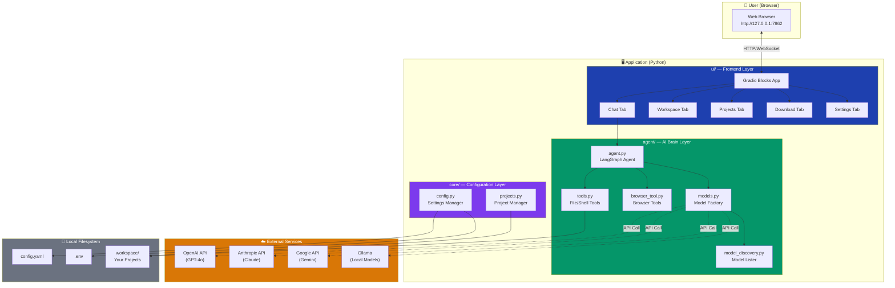

### The Three Layers

Think of the app like a sandwich with three layers:

| Layer | Package | Responsibility | Analogy |
|-------|---------|---------------|---------|
| **Frontend** | `ui/` | What the user sees and clicks | The restaurant's dining room |
| **Configuration** | `core/` | Settings, project management | The restaurant's operations manual |
| **AI Brain** | `agent/` | AI logic, tools, model connections | The kitchen where the work happens |

---

## 3. Key Concepts Explained

Before diving deeper, let's define some important concepts you'll see throughout the code:

### 🤖 What is an "Agent"?

In AI engineering, an **agent** is an AI application that can **take actions**, not just generate text. 
A regular chatbot just talks. An agent can:
- Read and write files
- Run commands
- Browse the web
- Make decisions about what to do next

Think of it like the difference between someone giving you **verbal directions** vs. someone who 
**drives you there** and makes turns based on traffic.

### 🧠 What is "ReAct" (Reasoning + Acting)?

ReAct is a pattern where the AI alternates between:
1. **Thinking** — "I need to check what files exist in the project"
2. **Acting** — Calls the `list_directory` tool
3. **Observing** — Reads the tool's output
4. **Thinking again** — "Now I see the structure, I should create `index.html`"
5. **Acting again** — Calls `write_file`

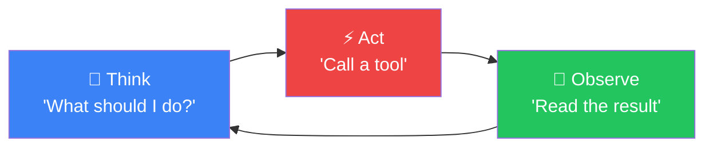

This loop continues until the agent decides the task is complete.

### 🔗 What is LangChain / LangGraph?

**LangChain** is a Python library that makes it easy to work with AI models from different 
providers (OpenAI, Anthropic, Google, etc.) using the same code. Instead of learning each 
provider's different API, you just use LangChain's unified interface.

**LangGraph** builds on LangChain to create **stateful agents** — AI programs that remember 
their conversation, use tools, and follow complex workflows. Think of LangChain as Lego bricks 
and LangGraph as the instruction manual for building something specific.

### 🎨 What is Gradio?

**Gradio** is a Python library that creates web interfaces with just a few lines of code. 
Instead of writing HTML, CSS, JavaScript, and a backend server, you describe what UI components 
you want (text boxes, buttons, dropdowns) and Gradio generates the entire web app for you.

---

## 4. Project Structure

```
agent-by-claude/
├── agent/                    # 🧠 AI Brain Layer
│   ├── __init__.py
│   ├── agent.py              # Creates the AI agent + streaming logic
│   ├── tools.py              # File/shell tools the agent can use
│   ├── browser_tool.py       # Browser automation tools (screenshots, etc.)
│   ├── models.py             # Creates AI model connections
│   └── model_discovery.py    # Lists available models from each provider
│
├── core/                     # ⚙️ Configuration Layer
│   ├── __init__.py
│   ├── config.py             # Reads/writes config.yaml and .env
│   └── projects.py           # Manages projects in workspace/
│
├── ui/                       # 🎨 Frontend Layer
│   ├── __init__.py
│   ├── app.py                # Main app entry point — wires tabs together
│   ├── chat_tab.py           # Chat interface with streaming
│   ├── workspace_tab.py      # Mini IDE (file tree + code editor + preview)
│   ├── project_tab.py        # Create/switch projects
│   ├── download_tab.py       # Download files or project ZIP
│   └── settings_tab.py       # Model selection + API key management
│
├── workspace/                # 📁 Your projects live here
│   └── snake/                # Example project
│       └── index.html
│
├── tests/                    # 🧪 Test suite
│   ├── conftest.py           # Shared test fixtures
│   ├── test_agent.py
│   ├── test_config.py
│   ├── test_env_loading.py
│   ├── test_projects.py
│   └── test_tools.py
│
├── config.yaml               # Active model + model list + active project
├── .env                      # API keys (never committed to git!)
├── .env.example              # Template for .env
├── pyproject.toml            # Python package config + dependencies
├── Makefile                  # Build/run shortcuts
└── README.md                 # Getting started guide
```

---

## 5. Component Deep Dives

### 5.1 The Agent (`agent/agent.py`)

This is the heart of the application — where AI meets action.

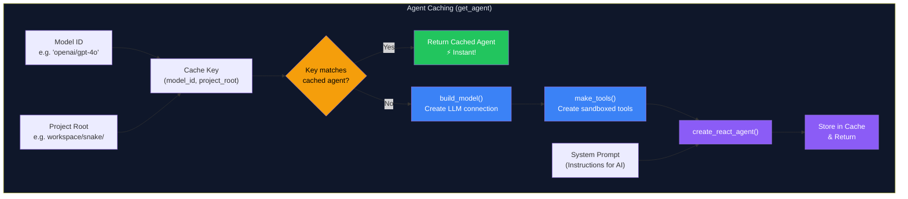

**What happens step by step:**

1. **`get_agent(model_id, project_root)`** is called when you send a chat message
2. It checks if an agent with the same model + project is already cached
3. **If cached** → returns instantly (no network calls, no rebuilding)
4. **If not cached** → creates a new LLM connection, sandboxed tools, and ReAct agent, then caches it
5. The cache is **invalidated** automatically when you switch models or projects

> **Why cache?** Building an agent involves creating an API connection, initializing tools,
> and compiling a LangGraph — all of which is unnecessary on every message when the model
> and project haven't changed. Caching makes subsequent messages significantly faster.

**The System Prompt** is like giving a new employee their job description:
> "You are an expert AI coding assistant. You have tools to read files, write files, 
> run commands... Before using any tool, explain what you're about to do. Stop when done."

### 5.2 The Streaming System (`stream_response`)

When the AI responds, it doesn't send everything at once — it **streams** chunks in real 
time, just like ChatGPT shows text appearing word by word.

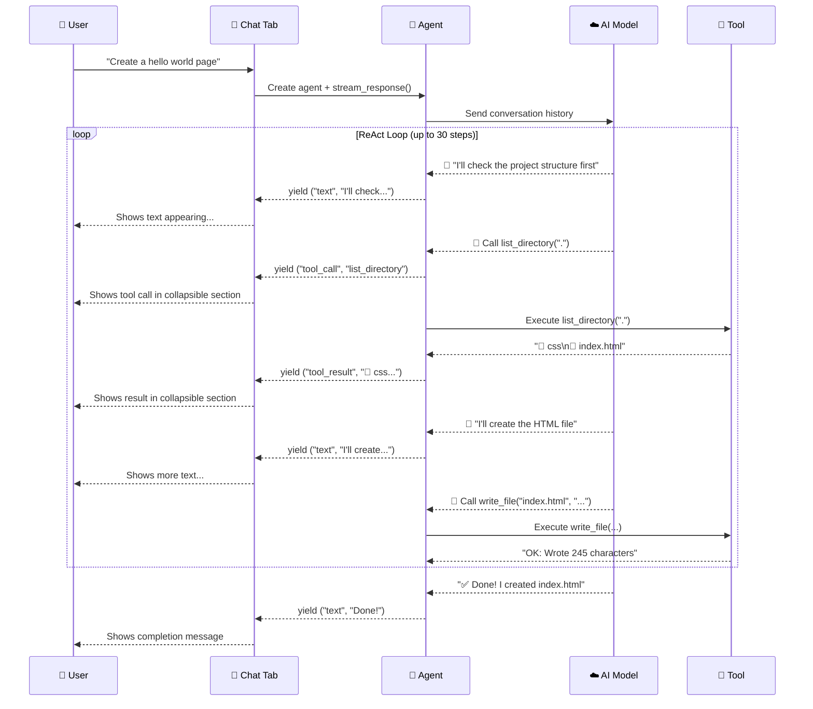

**The four chunk types:**

| Chunk Type | What It Contains | How It Appears in UI |
|------------|-----------------|---------------------|
| `"text"` | AI's explanations and thoughts | Normal text in the chat bubble |
| `"step"` | Step counter ("Step 1 — `list_directory`") | Animated progress indicator |
| `"tool_call"` | Tool name + arguments (JSON) | Collapsible "🔧 Tool call" section |
| `"tool_result"` | Tool output | Collapsible "📤 Result" section |

### 5.3 The Tool System (`agent/tools.py`)

Tools are functions that give the AI the ability to interact with your computer. Each tool 
is a regular Python function decorated with `@tool` from LangChain.

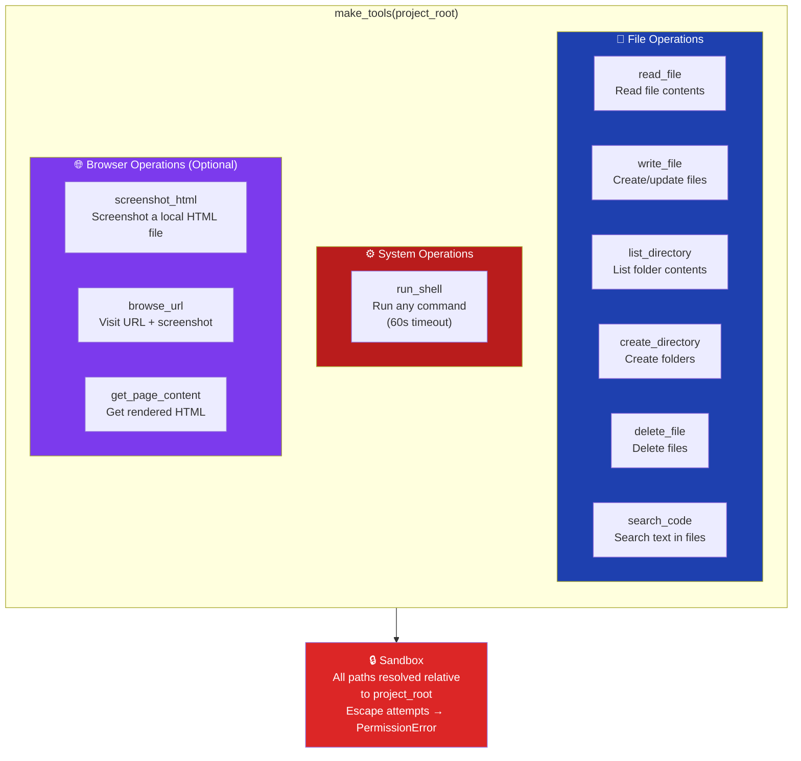

**How tools work internally — the Factory Pattern:**

The `make_tools()` function uses a design pattern called a **factory**. Instead of creating 
tools globally, it creates them at runtime and "hardwires" the project path into each one. 
This is done using **closures** — inner functions that remember the variables from their 
enclosing function.

```python
def make_tools(project_root: Path) -> list:
    # This inner function "remembers" project_root even after make_tools() returns
    @tool
    def read_file(path: str) -> str:
        target = _resolve(project_root, path)  # ← project_root is "captured"
        return target.read_text()
    
    return [read_file, ...]  # Return the inner function
```

> **Why a factory?** Because different projects need different sandboxes. If you switch 
> from project "snake" to project "blog", the tools need to point to the new folder.

### 5.4 The Model System (`agent/models.py` + `agent/model_discovery.py`)

This app can talk to AI models from four different companies. The model system makes this 
seamless.

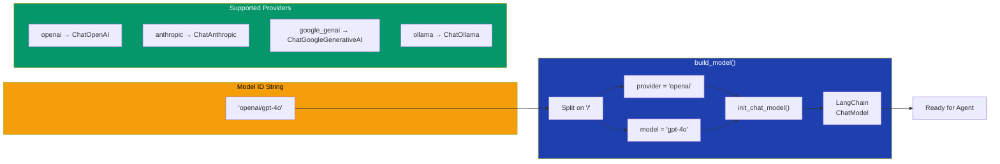

**The model ID format** — `provider/model-name`:
- `openai/gpt-4o` → Use OpenAI's GPT-4o model
- `anthropic/claude-3-5-sonnet-20241022` → Use Anthropic's Claude 3.5 Sonnet
- `google_genai/gemini-2.0-flash` → Use Google's Gemini 2.0 Flash
- `ollama/llama3.2` → Use Meta's Llama 3.2 running locally

**Model Discovery** fetches available models dynamically:

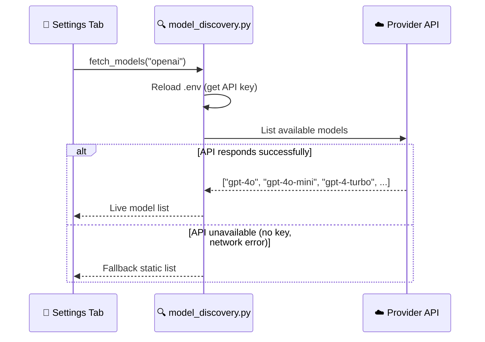

> **Why fallback lists?** If you don't have an API key for a provider yet, or the API is 
> down, the app still shows you a list of known models so you can configure things before 
> actually connecting.

### 5.5 The UI Layer (`ui/`)

The frontend is built with Gradio Blocks — a Python framework that generates a web interface.

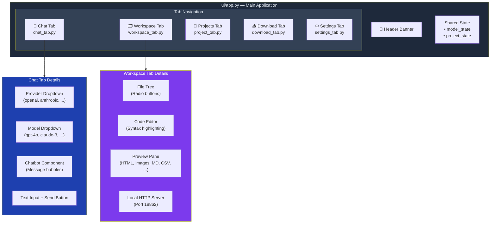

**The Event System — how UI interactions work:**

Gradio uses an event-driven pattern. You register callback functions that run when things 
happen:

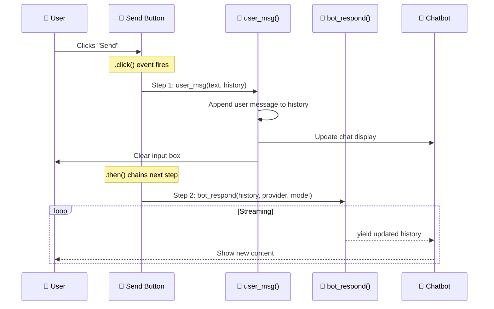

> **The `.then()` pattern** chains actions: first add the user's message to chat, 
> *then* start the AI response. This ensures the user sees their own message immediately.

### 5.6 The Workspace Tab — A Mini IDE

The Workspace tab is the most complex UI component. It provides a VS Code-like experience:

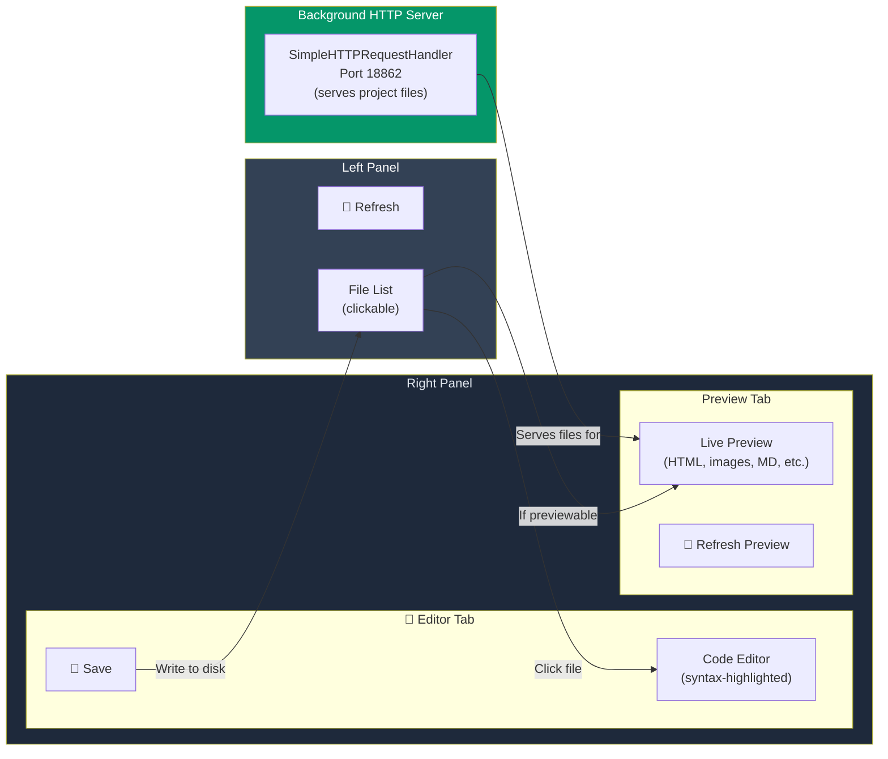

**Why a local HTTP server?** HTML previews need to load CSS, JavaScript, and images using 
relative paths. A simple `file://` URL wouldn't work properly, so the app starts a tiny 
HTTP server that serves your project files — just like a real web server.

---

## 6. How Everything Connects

This diagram shows which module depends on which:

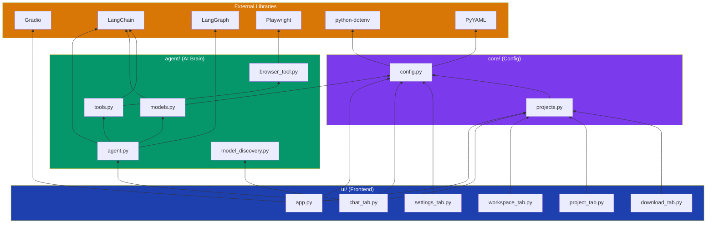

**Key insight:** Notice how `core/` has **zero dependencies on `agent/` or `ui/`**. This is 
good software design called **layered architecture** — lower layers don't know about higher 
layers. This means you could swap out the entire UI library (replace Gradio with something 
else) without changing any agent or config code.

---

## 7. Data Flow: From User Message to AI Response

Here's the complete journey of a single user message through the system:

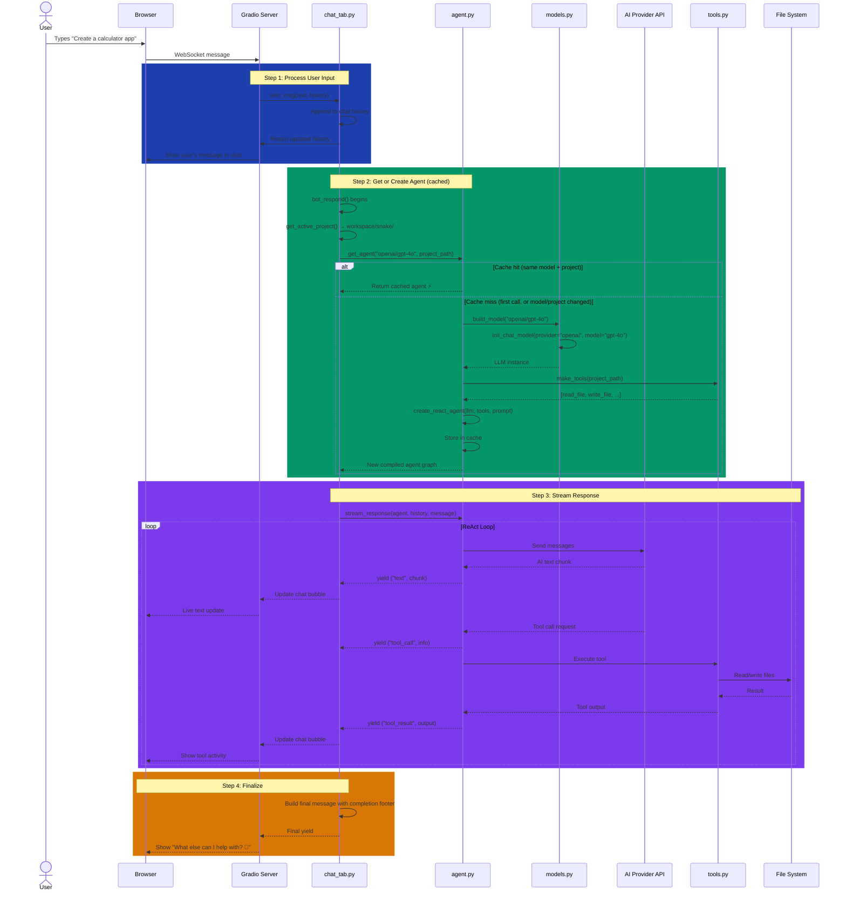

---

## 8. The Tool System

### How the AI Decides Which Tool to Use

The AI doesn't follow a script — it decides which tool to call based on the conversation. 
This is the magic of the ReAct pattern. The system prompt tells the AI what tools are 
available and how to use them.

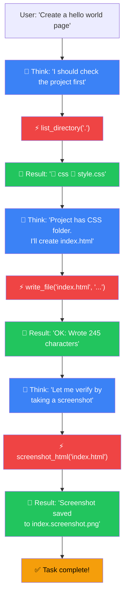

### Tool Reference

| Tool | Arguments | What It Does | Example |
|------|-----------|-------------|---------|
| `read_file` | `path` | Reads a file's contents | `read_file("index.html")` |
| `write_file` | `path`, `content` | Creates or overwrites a file | `write_file("app.js", "console.log('hi')")` |
| `list_directory` | `path` (default `.`) | Shows files and folders | `list_directory("src")` |
| `create_directory` | `path` | Creates a folder (and parents) | `create_directory("src/components")` |
| `delete_file` | `path` | Deletes a single file | `delete_file("old.txt")` |
| `search_code` | `query`, `path` | Searches for text across files | `search_code("TODO", ".")` |
| `run_shell` | `command` | Runs any shell command | `run_shell("npm test")` |
| `screenshot_html` | `file_path` | Screenshots a local HTML file | `screenshot_html("index.html")` |
| `browse_url` | `url` | Visits a URL + screenshots | `browse_url("http://localhost:3000")` |
| `get_page_content` | `url` | Gets rendered HTML from a URL | `get_page_content("http://localhost:3000")` |

---

## 9. Multi-Provider Model Support

One of the coolest features of this app is **model agnosticism** — you can switch between 
AI providers without changing any code.

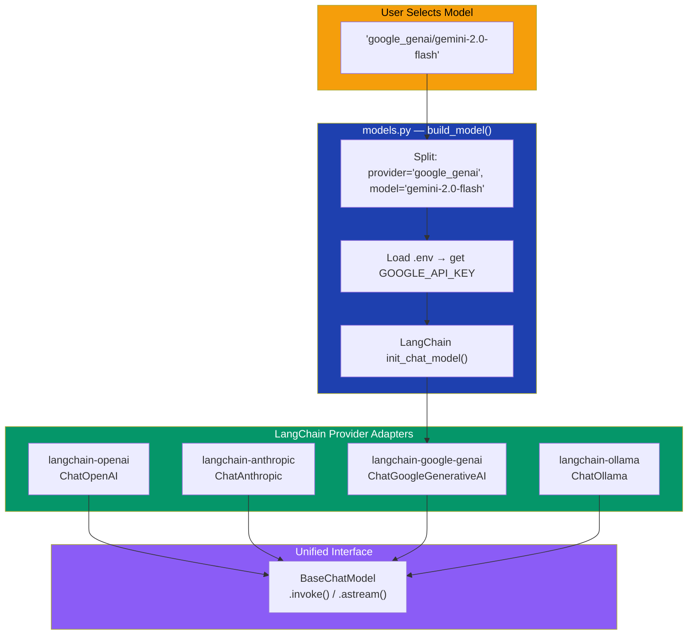

**How this works (the Adapter Pattern):**

Each AI provider has a different API. LangChain provides **adapter libraries** that wrap 
each provider's API into a common interface called `BaseChatModel`. This means the agent 
code doesn't care whether it's talking to GPT-4o, Claude, or Gemini — it just calls 
`.invoke()` or `.astream()` on the model.

This is called the **Adapter Pattern** in software design — like using a travel power 
adapter so your laptop charger works in any country.

---

## 10. Configuration System

The app uses two configuration files:

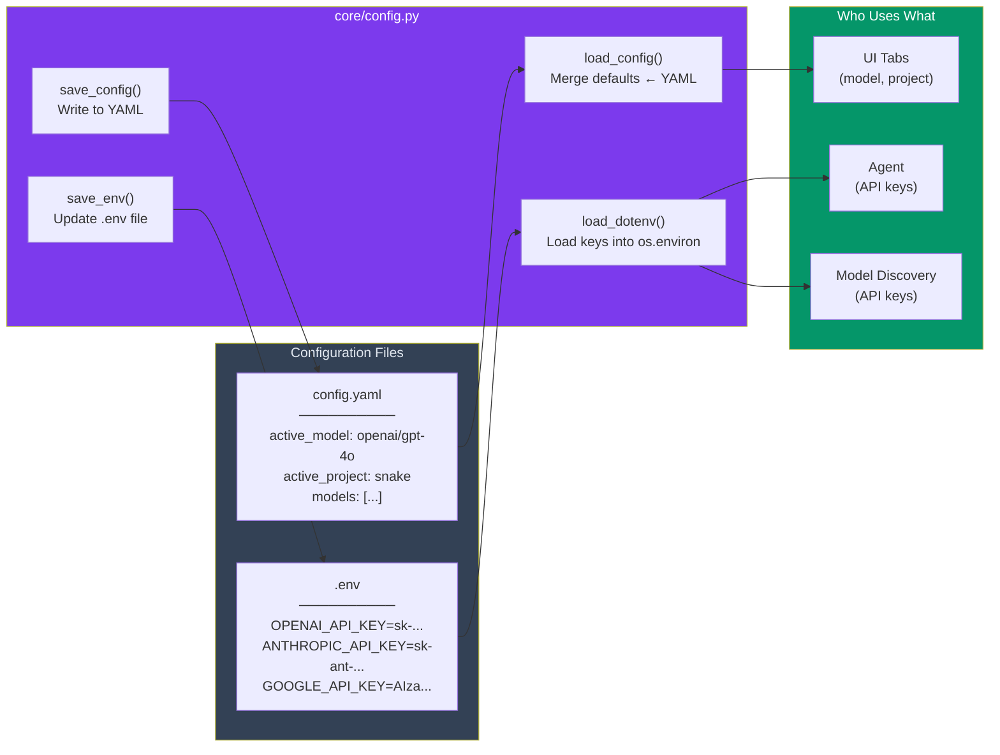

**Why two files?**

| File | Contains | Committed to Git? | Why Separate? |
|------|----------|-------------------|---------------|
| `config.yaml` | App settings (model, project) | ✅ Yes | Settings you'd want to share |
| `.env` | Secret API keys | ❌ Never! | Keys must stay private |

**The defaults cascade:** When `load_config()` runs, it:
1. Starts with hardcoded defaults (so the app always works)
2. Overwrites with values from `config.yaml` (your preferences)
3. The result is a merged config dictionary

---

## 11. Security: The Sandbox

Every file operation the AI performs goes through a **sandbox** — a security boundary that 
prevents the AI from accessing files outside your project folder.

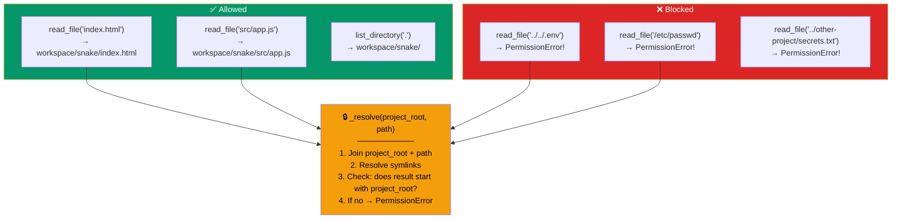

**How `_resolve()` works:**

```python
def _resolve(project_root: Path, relative_path: str) -> Path:
    resolved = (project_root / relative_path).resolve()  # Follow symlinks
    if not str(resolved).startswith(str(project_root.resolve())):
        raise PermissionError("Access denied: path is outside the project root.")
    return resolved
```

The trick is `.resolve()` — it converts `../../.env` into the actual absolute path, 
then checks if that path is still inside the project folder. Sneaky path traversal 
attacks like `../../../etc/passwd` are caught and blocked.

> ⚠️ **Note:** The `run_shell` tool does NOT have the same sandbox protection. It runs 
> arbitrary commands in the project directory. This is intentional (the AI needs to run 
> `npm install`, `python test.py`, etc.) but means you should be aware that the AI 
> could theoretically run harmful commands. The 60-second timeout provides some protection.

---

## 12. Testing Strategy

The project uses **pytest** with a clean fixture-based approach:

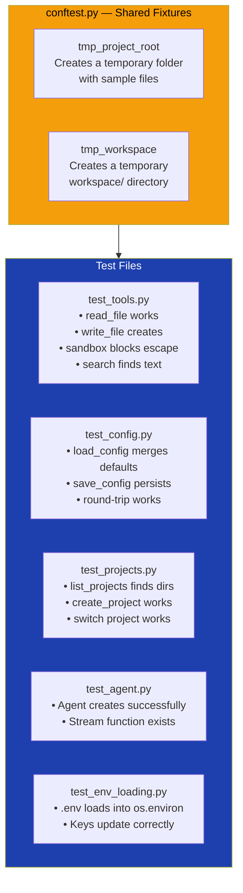

**Run tests with:**
```bash
make test  # or: .venv/bin/pytest tests/ -v
```

---

## 13. Glossary

| Term | Definition |
|------|-----------|
| **Agent** | An AI system that can take actions (use tools) to complete tasks, not just generate text |
| **ReAct** | A pattern where AI alternates between Reasoning (thinking) and Acting (using tools) |
| **LangChain** | Python library providing a unified interface to multiple AI model providers |
| **LangGraph** | Library built on LangChain for creating stateful AI agents with tool use |
| **Gradio** | Python library for quickly building web UIs for machine learning applications |
| **Tool** | A function the AI can call to interact with the outside world (files, shell, browser) |
| **Streaming** | Sending data piece by piece as it's generated, rather than all at once |
| **Sandbox** | A security boundary that restricts where the AI can read/write files |
| **System Prompt** | Instructions given to the AI that define its behavior and capabilities |
| **Provider** | A company offering AI model APIs (OpenAI, Anthropic, Google, Ollama) |
| **Closure** | A function that remembers variables from its enclosing scope (used in the tool factory) |
| **Factory Pattern** | A design pattern where a function creates and returns other objects/functions |
| **Adapter Pattern** | A design pattern that wraps different interfaces behind a common one |
| **WebSocket** | A protocol for real-time bidirectional communication between browser and server |
| **Fixture** | In testing, a reusable setup that creates test data (like a temporary directory) |
| **Headless Browser** | A browser without a visible window, used for automation and screenshots |

---

> **Next Steps for Learning:**
> 1. Read through `agent/tools.py` — it's the simplest file and shows how tools work
> 2. Try modifying the system prompt in `agent/agent.py` to change the AI's behavior
> 3. Add a new tool (e.g., `count_lines` that counts lines in a file)
> 4. Run `make test` and study how the tests validate each component
> 5. Read the [LangGraph documentation](https://python.langchain.com/docs/langgraph) to learn more about agents
