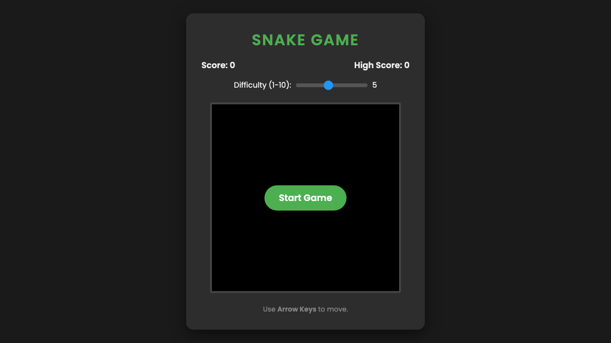

# Snake Game

A classic, web-based Snake Game built with HTML5 Canvas, CSS, and JavaScript.

## Game Design

The game is designed to be simple, responsive, and fun. It features:

- **HTML5 Canvas Rendering:** The game board, snake, and food are drawn dynamically on a 400x400 canvas grid.
- **Dynamic Difficulty:** Players can choose a difficulty level from 1 to 10 before starting. Higher difficulties increase the snake's speed and provide a higher score multiplier (10 × difficulty per food item).
- **Score Tracking:** The game tracks your current score and saves your High Score across sessions using the browser's `localStorage`.
- **Visual Polish:** The snake features a distinct head color with simple "eyes" that look in the direction of movement, and the food is rendered as a red circle.
- **Input Buffering:** The movement logic includes input buffering to prevent the snake from accidentally reversing into itself when multiple keys are pressed quickly.

## How to Play

1. **Start the Game:** Open `index.html` in your web browser and click "Start Game".
2. **Select Difficulty:** Use the slider to choose a difficulty level (1 is the slowest, 10 is the fastest).
3. **Controls:** Use the **Arrow Keys** (Up, Down, Left, Right) to navigate the snake.
4. **Objective:** Eat the red food circles to grow your snake and increase your score.
5. **Game Over:** The game ends if the snake hits the walls of the canvas or collides with its own body.
6. **Restart:** Click the "Play Again" button on the Game Over screen to try and beat your high score!

## Screenshots

